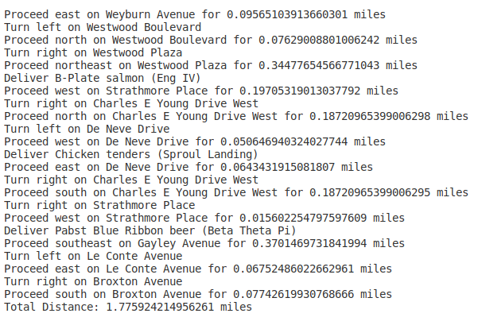

# GooberEats
 

GooberEats is a simple delivery logistics system that loads and indexes a bunch of Open Street Map geopspatial data consisting of latitudes and longitudes for thousands of streets. It uses this data to produce delivery plans and navigation instructions that fulfill a set of delivery requests.

My solution implements Dijkstra's Algorithm for point to point navigation between geospatial coordinates, and Simulated Annealing for optimizing the delivery route.
Also included in the solution is my implementation of an open hash table that uses a table of prime numbers for capacity.
